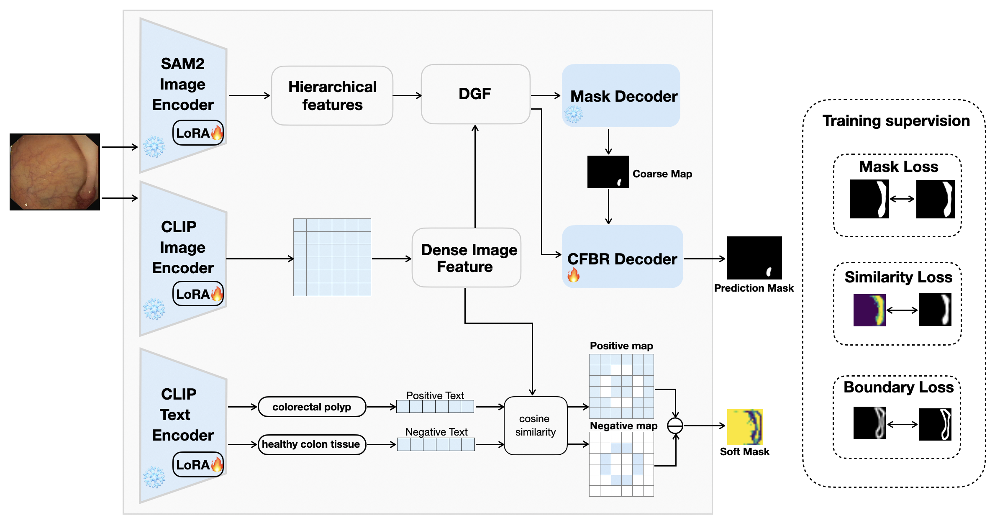
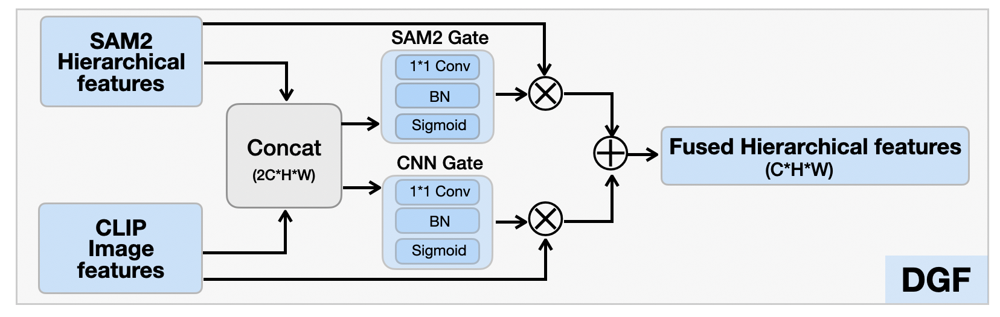
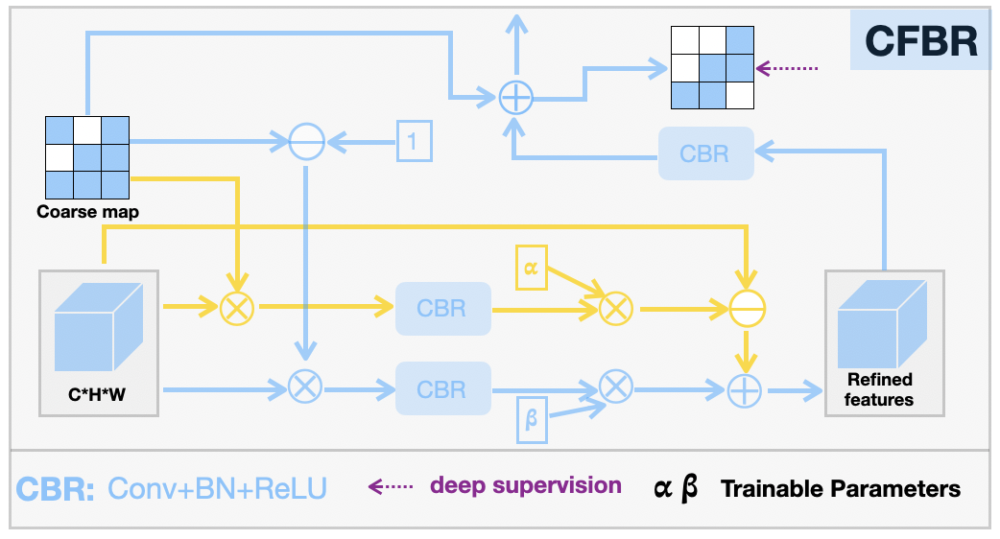

# CLIP-SAM2

Research code for a static polyp-segmentation model that combines a SAM2 Hiera-L image encoder with BiomedCLIP semantic prompting.

## What is included

- SAM2 image-encoding and mask-decoding code
- BiomedCLIP/OpenCLIP integration for image and text features
- LoRA adaptation for the SAM2, visual, and text branches
- Three-scale gated fusion and CFBR refinement
- Mask, semantic-similarity, and boundary-similarity losses
- Training, testing, fixed-threshold evaluation, and lightweight tests

The current model entrypoint is `MyTrain.py`; the polyp7 implementation is in `models/polyp5.py` for historical compatibility.

## Method overview

This repository provides the research implementation and methodological figures for a static-image framework for colorectal polyp segmentation. The model combines the hierarchical visual representation of a SAM2 Hiera-L image encoder with the domain-aware semantic representation of BiomedCLIP. Unlike video-oriented SAM2 pipelines, the model processes each colonoscopy image independently and does not rely on temporal memory.

For an input image, the SAM2 and BiomedCLIP image branches extract complementary features. A three-scale dual-gated fusion module integrates these features at the 22$\times$22, 44$\times$44, and 88$\times$88 resolutions. The fused representation is passed to the SAM2 mask decoder to obtain a coarse prediction and is subsequently refined by the three-stage CFBR decoder. In parallel, BiomedCLIP text prompts describing a colorectal polyp and healthy colon tissue provide positive--negative semantic similarities. Mask, semantic-similarity, and boundary-similarity objectives jointly supervise the segmentation and semantic refinement process.

## Architecture figures

### Overall architecture



### Dual-gated feature fusion



### CFBR refinement decoder



## Model Weights

The trained experiment checkpoints for CLIP-SAM2-polyp are publicly available on Hugging Face:

[Download CLIP-SAM2-polyp Weights](https://huggingface.co/leojobs/CLIP-SAM2-polyp/tree/main)

## What is intentionally excluded

This GitHub repository is source-only. Datasets, large pretrained assets, experiment checkpoints, prediction masks, evaluation tables, explainability outputs, logs, and caches are not stored directly in the repository. The released experiment checkpoints are hosted separately on Hugging Face through the link above.

Before running the code, provide the required SAM2 and BiomedCLIP pretrained assets and your own dataset/split paths. The command-line defaults use relative paths such as `data/TrainDataset` and `data/TestDataset`.

## Basic usage

```bash
python MyTrain.py \
  --train-path /path/to/TrainDataset \
  --split-dir /path/to/splits \
  --sam-lora-rank 128 \
  --clip-lora-rank 128 \
  --text-lora-rank 64 \
  --batchsize 16

python MyTest.py \
  --run-dir /path/to/checkpoint/run_directory \
  --test-path /path/to/TestDataset

python MyEval.py \
  --models run_name \
  --data-path /path/to/TestDataset
```

This code is intended for research use. Please check and retain the upstream licensing and attribution requirements for the vendored SAM2 and BiomedCLIP components.
